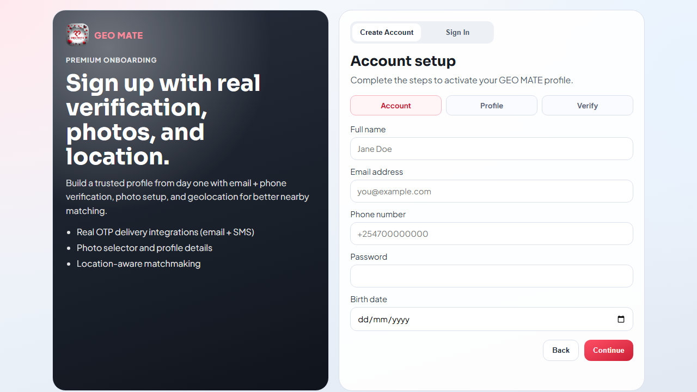
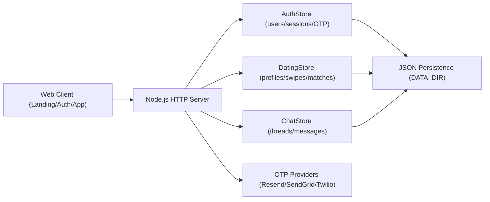

# GEO MATE

GEO MATE is a modern web-first dating product focused on trust, quality matching, and smooth onboarding.

## Product Positioning

- Category: Consumer social/dating platform
- Wedge: Geo-aware matching + verified onboarding + lightweight in-browser app
- Experience: Tinder/Bumble-style flow adapted for a complete web product and phone-installable PWA

## Problem

Most dating products struggle with:

- low-trust onboarding and fake accounts
- random swipe fatigue vs meaningful compatibility
- weak cross-device experience unless users install a native app

## Solution

GEO MATE provides:

- multi-step onboarding with email + phone verification
- profile quality signals (photos, interests, location, intent)
- recommendation ranking engine with compatibility/recency/trust/fairness factors
- swipe, match, and real-time style messaging flow
- PWA install support for phone home-screen usage

## Live Demo

- Public website (GitHub Pages): https://georgebenedict77.github.io/geo-mate/
- Source code: https://github.com/georgebenedict77/geo-mate
- Latest release: https://github.com/georgebenedict77/geo-mate/releases
- One-click backend deploy (Render): https://render.com/deploy?repo=https://github.com/georgebenedict77/geo-mate

## Screenshots And Demo Media

### Landing


### Onboarding



### In-App Experience


### Demo GIF


## Architecture



## Core Capabilities

- Landing website + waitlist
- Account creation and sign-in
- Email + phone OTP verification
- Discover / swipe / match loop
- Inbox + thread messaging
- Profile management (photos, interests, location, intent)
- PWA install support (`manifest.webmanifest` + service worker)

## Local Setup

```bash
npm install
npm start
```

Open:

- `http://localhost:3050/` landing website
- `http://localhost:3050/auth` onboarding/sign-in
- `http://localhost:3050/app` dating app

## Quality Gates

- Syntax checks across `src`, `public`, and `scripts`
- Smoke test that boots server and validates critical flows

Run locally:

```bash
npm run ci
```

CI pipeline:

- `.github/workflows/ci.yml`

## Deployment (Public URL + 24/7)

This repo ships with `render.yaml` for Render blueprint deployment.

1. Push to GitHub.
2. Create a Render Blueprint service from repo.
3. Keep `DATA_DIR=/var/data` and mounted disk.
4. Use Starter+ plan for always-on service.
5. Configure custom domain in Render.

## OTP Provider Setup

Use `.env.example` as template.

Email (choose one):

- `EMAIL_PROVIDER=resend` + `RESEND_API_KEY` + `EMAIL_FROM`
- `EMAIL_PROVIDER=sendgrid` + `SENDGRID_API_KEY` + `EMAIL_FROM`

SMS:

- `SMS_PROVIDER=twilio`
- `TWILIO_ACCOUNT_SID`
- `TWILIO_AUTH_TOKEN`
- `TWILIO_FROM_NUMBER`

Production safety:

- `NODE_ENV=production`
- `SHOW_DEV_CODES=false`

## API Surface

- `POST /waitlist`
- `POST /auth/register`
- `POST /auth/login`
- `POST /auth/refresh`
- `POST /auth/logout`
- `GET /auth/me`
- `POST /auth/profile`
- `POST /auth/send-email-code`
- `POST /auth/send-phone-code`
- `POST /auth/verify-email`
- `POST /auth/verify-phone`
- `POST /recommendations`
- `POST /swipe`
- `GET /matches`
- `GET /inbox`
- `GET /messages?with=<userId>`
- `POST /messages`

## Release And Governance

- Changelog: `CHANGELOG.md`
- License: `LICENSE`
- Release notes:
  - `docs/releases/v1.1.0.md`
  - `docs/releases/v1.1.1.md`
